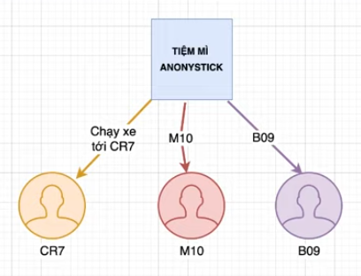
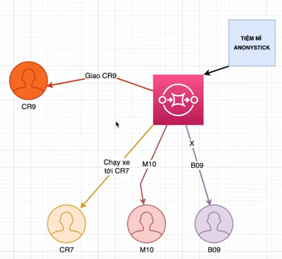
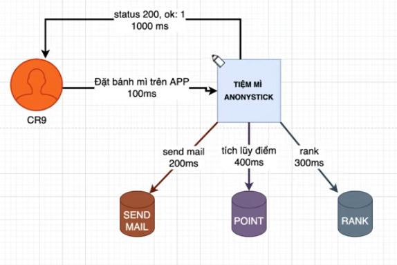
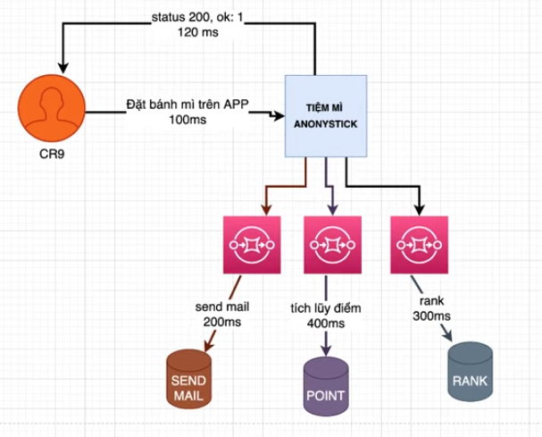
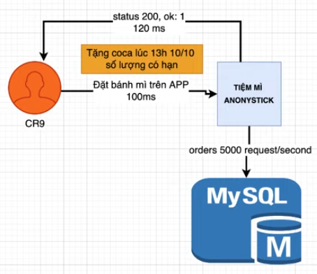
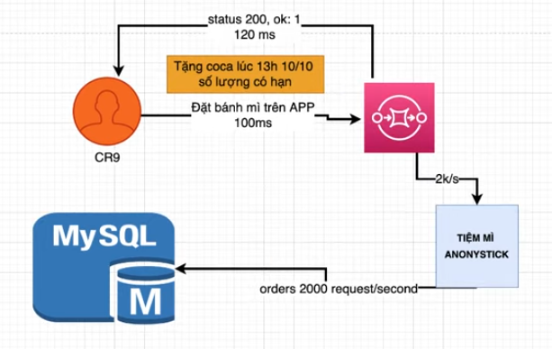

# Message Queue

When applying to a company. Employer may ask you some questions like this: 

**_1. Why do you use Message Queue?_**
**Analysis**: Employer want to know you really did it or not. Maybe you inherited it from old employees and then wrote it on your CV, or you used it for yourself demand. etc.

**_2. What are advantage and drawback of MQ?_**
**Analysis**: They want to know your purpose which you made a decion to use it on your project.

**_3. Compare RabbitMQ and Kafka? Which instances will be use RabbitMQ and Kafka?_**

**Analysis**: They want to know why do you choose it and not Kafka? Because Each MQ have pros and cons. We need to use it with clear purpose.

## I. Why do you use MQ?
**1. Separate services from your system.**
Assume, you have a tranditional website architecture like this: 

_Figure 1: Tranditional website architecture_
You can see clients will request directly to server. If have any problems with server, the system won't responding.

_Figure 2: Seprate services_
If you use MQ, it will play a role as a middleware to receive request from clients and return result of server after processing. The webserver only interested in handling the request which sent from MQ.

**2. Reducing timeouts between services.**

_Figure 3: Services wait for each other_
In Figure 3, when a client places an order for bread on the app(spend 100ms). The server receives this request and sents a mail to customer to notify to user (spend 200ms). At the same time, the server will accumulate point for the user(spend 400ms). The server also sort the user rank for furture sales purposes(spend 300ms). The system must wait for all services to complete their work before sending the order status to the user. Total time is 1000ms.

In this case, sending mail, collecting point and sorting rank are separate jobs. Waiting on the webserver is useless.

_Figure 4: Reducing timeouts_
Now, we use MQs to receive request from the webserver without paying attention to the status of other service. The webserver will reply immediately successfull status for user. 

**3. Coordinating requests at the peak.**

_Figure 5: Overloading at the peak_

Assume, you have a promotion at 10 AM on Oct 10th that when a customer order a bread successfully, get a can of cocacola. The gifts applied for the first 2000 people. From first 10 mins, there are 5000 reqs/s to be sent to your webserver. However, MySQL only handle a maximum of 2000 reqs/s(best optimization). Your system will be overloaded. 

_Figure 6: Reducing overloading at the peak_

In this time, MQs will be coordinate the number of requests to the DB appropriately. The remaining request will be saved in queue, and proccessed gradually.

### Cons
- Increase system complexity.
- Have to deal with lossy.
- Reduced system consistency(need to asynchronous between MQ and other services.)

## 2. Compare RabbitMQ and Kafka.
To be continue ...